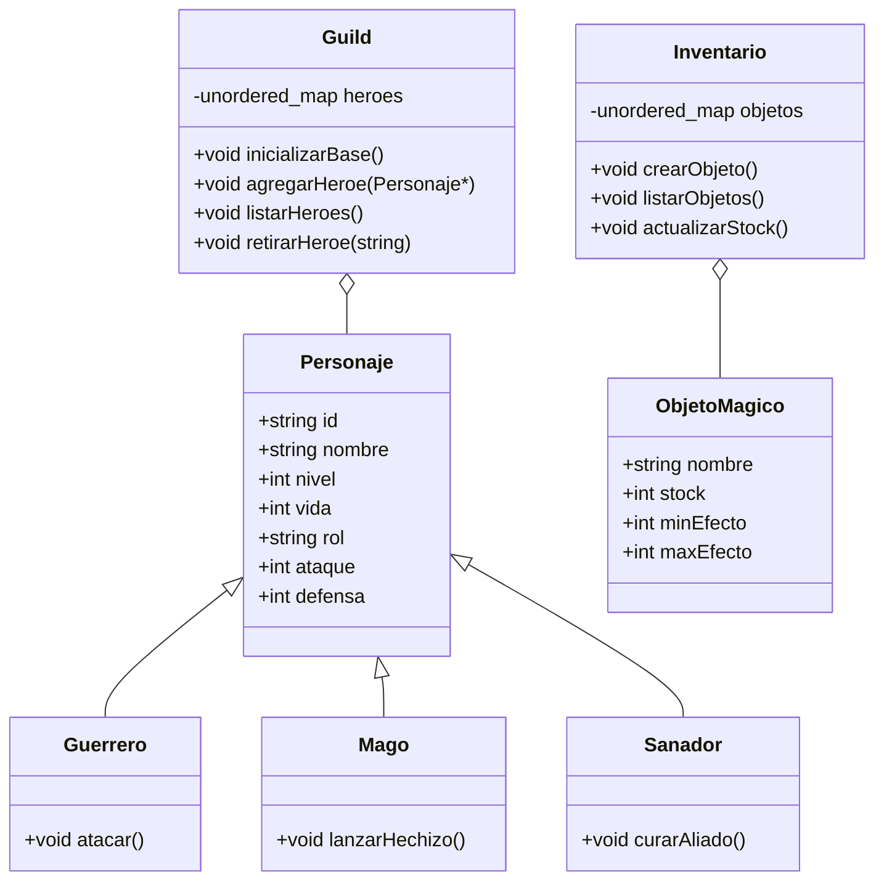

```mermaid
classDiagram
    class Personaje {
        +string id
        +string nombre
        +int nivel
        +int vida
        +string rol
        +int ataque
        +int defensa
    }

    
    class Guerrero {
        +void atacar()
    }

    class Mago {
        +void lanzarHechizo()
    }

    class Sanador {
        +void curarAliado()
    }

    class Guild {
        -unordered_map<string, Personaje*> heroes
        +void inicializarBase()
        +void agregarHeroe(Personaje*)
        +void listarHeroes()
        +void retirarHeroe(string)
    }

    class ObjetoMagico {
        +string nombre
        +int stock
        +int minEfecto
        +int maxEfecto
    }

    class Inventario {
        -unordered_map<string, ObjetoMagico> objetos
        +void crearObjeto()
        +void listarObjetos()
        +void actualizarStock()
    }

    Personaje <|-- Guerrero
    Personaje <|-- Mago
    Personaje <|-- Sanador
    Guild o-- Personaje 
    Inventario o-- ObjetoMagico 
```
